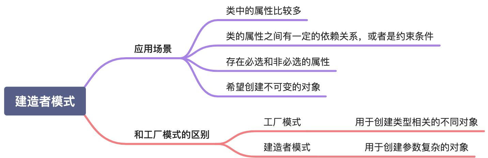

# 建造者模式
> 其实在Golang中对于创建参数比较多的对象的时候，我们常见的做法是必填参数直接传递，可选参数通过传递可变的方法进行创建。
> 
> 本文会先实现课程中的建造者模式，然后再实现我们常用的方式。

## 建造者模式介绍
建造者模式（Build Pattern）使用多个简单的对象一步一步构建一个复杂的对象。一个Builder类会一步一步的构造最终的对象，该Builder类是独立于其他对象的。

> 意图：将一个复杂的构建与其表示相分离，使得同样的构建可以创建不同的表示
> 
> 主要解决：主要解决在软件系统中，有时候面临着"一个复杂对象"的创建工作，其通常由各部分的子对象用一定的算法构成；由于需求的变化，这个复杂对象的
> 各个部分经常面临着剧烈的变化，但是将它们组合在一起的算法却相对稳定。
> 
> 何时使用：一些基本部件不会变，而其组合经常变化的时候
> 
> 如何解决：将变与不变分开
> 
> 关键代码：建造者：创建和提供实例 导演：管理建造出来的实例的依赖关系
> 
> 优点：1、建造者独立，易扩展 2、如内部变化复杂，会有很多建造类
> 
> 缺点：1、产品必须有共同点，范围有限制 2、需要生成的对象内部属性相互依赖
> 
> 使用场景：1、需要生成对象具有复杂的内部结构 2、需要生成的对象内部属性相互依赖
> 
> 注意事项：与工厂模式的区别是：建造者模式更加关注与零件装配的顺序
> 
